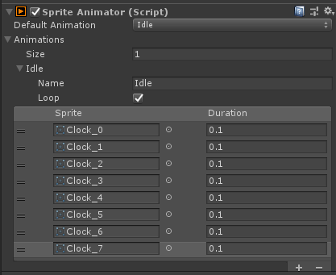

# Sprite Animations
Used for quickly implementing animations for individual sprite renderers. WIP!

## Requirements
- .NET Framework 4.5
- Git

## Installation
If using 2018.3.x or higher, you can add a new entry to the manifest.json file in your Packages folder:
```json
"com.popcron.spriteanims": "https://github.com/popcron/spriteanims.git"
```

## Example
```cs
using UnityEngine;
using Popcron.Animations;

public class Player : MonoBehaviour
{
    [SerializeField]
    private bool moving = false;

    [SerializeField]
    private SpriteAnimator animator;
	
    private void Update()
    {
        animator.Animation = moving ? "Moving" : "Idle";
    }
}
```
